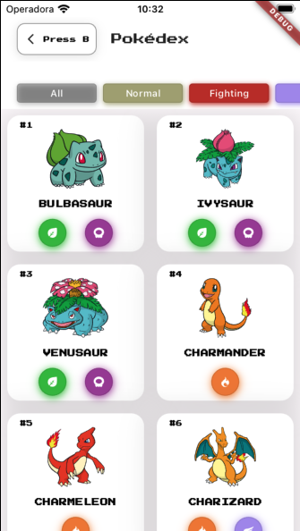
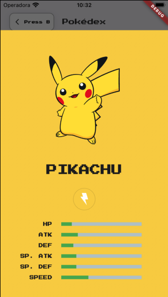
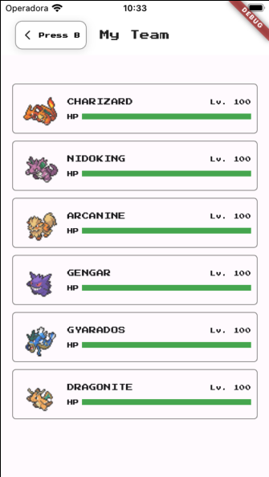

# PokéFlutter  

## 📱 Overview  
Este projeto é uma aplicação Flutter desenvolvida para ter uma primeira experiência com a Framework. É uma aplicação simples utilizando a API de Pokémon, trazendo algumas nostalgias dos jogos da Game Freak/Nintendo.   

## 🛠️ Tecnologias  
- **Flutter** (Framework para desenvolvimento mobile multiplataforma)  
- **Dart** (Linguagem de programação)   

## ✨ Features  
- Lista de Pokémon [Pokédex]
- Lista de itens e suas respectivas descrições 
- Meu time preferido da região de Katon [hahaha]  
- Dados e estatística de cada Pokémon 

## 🎨 Screenshots  
Aqui estão algumas capturas de tela da aplicação:  

<p align="center" style="display: flex;justify-content: space-between;">
  
  
  
</p>

## 🚀 Como Executar o Projeto  
1. Clone o repositório:  
   ```bash  
   git clone https://github.com/kendyyahiro/pokeflutter  
